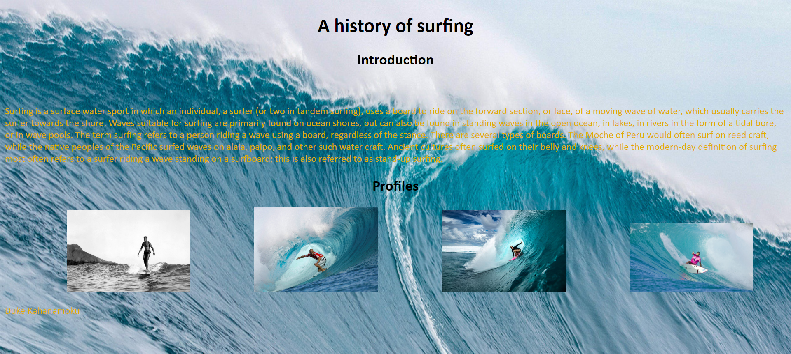
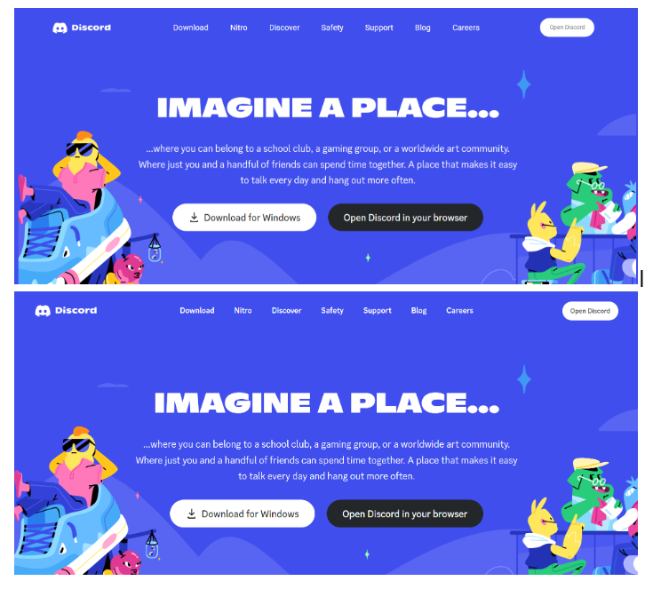

  
## HTML and CSS
  
  In the beginning we primarily used HTML and CSS to create our webpages, frankly using CSS and HTML the webpages looked less than ideal.  Customization was hard and having simple centering was harder.  I think raw HTML and CSS are hard to use on its own because you limit yourself to other premade modules.  HTML and CSS is like the first stone wheel, it works but in certain cases might want to use tools like Bootstrap to customize the wheel for different scenarios.  Everyone shares the road and we have different wheels but at the end of the day we still want the wheels to work the same and obey the laws of the road. 
  
 

## BootStrap
  
  Bootstrap has a lot of functionality comapred to just raw HTML and CSS.  Bootstrap gives user's an overall standard of tools for developers so that they don't have to reinvent the wheel everytime.  Like how I mentioned in the coding standarads essay, developer need to have standards when it comes to coding and having standardized tools is helpful for a company.  I like how BootStrap is another tool for HTML and CSS and isn't a reinvention of it.  Bootstrap has a lot of different functionality which can be a double edged sword, there can be so much information when looking at BootStrap that it can be hard to figure out where to begin.  
  
  One thing I dislike about Bootstrap and HTML is that it can be hard to see and organize everything, for example if you use mutliple divs inside divs it can be hard to see where the start and end is.  It is especially hard when you are trying to find and solve a problem nested inside multiple tags.   
  
## Investment and Benefits
  
  
