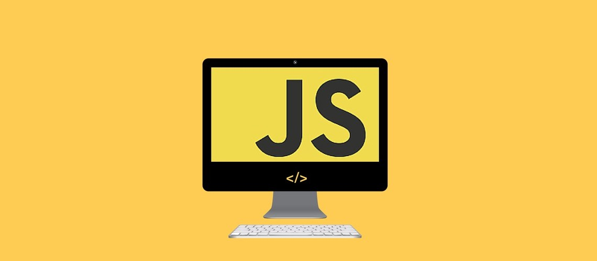

  
## My Javascript Experience So Far
  
  My coding experience is in Python, Java, C, C++, and Javascript, learned in that order. I think that Python and javascript are similar in that they are easier to pick up because the languages do not conform to rigid syntax like others.  Javascript and Python also have many libraries and frameworks that can make processes easier.  Javascript also does not need a complier to run unlike the other languages and you can use your browser (JSFiddle).  As mentioned earlier Javascript is more flexible since Javascript is a dynamically typed language.  Unlike Java where you would have to specify the type of variable before initialization.  
  
## Javascript With An Software Engineer Perspective
  
  I think Javascript is a good programming language from a software engineer's perspective, Javascript has become increasingly popular for both back end and front end development. There has been a significant increase in the number of AngularJS jobs, because there has been a demand for devloping mobile applications. In terms of speed we cannot compare Java and Javascript that well since there are many factors that could influecne the speed. Overall I think Javascript will be extremely useful for software engineers and myself.
  
## Classroom Thoughts
  
  I think ICS314 will challenge me but create a programmer who can solve complex problems with time constraints.  I think the athletic software engineering is a good way to measure progression in coding.  I think the practice WODS are useful they give me a reason to practice and hone my skills.  Like any science/math related course the only way to improve is to solve the practice problems.  The practice WODS also give myself a positive feedback loop when coding; its easy to get demoralized when stuck on code or a line.  However, after finding the solution and achieveing it is a brief moment of euphoria for me.  I think the flipped classroom style of learning is a bit stressful since I am not used to it and tests give me anxiety, but I am sure as time goes on it will make me a better programmer.
