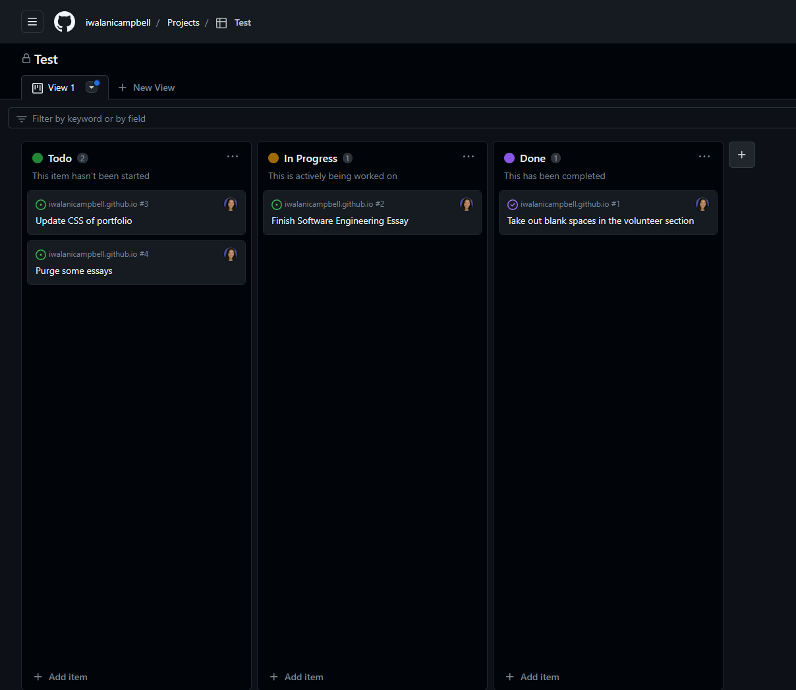

  
  Over the past semester, I learned a variety of software engineering concepts, but most importantly I experienced them. After ICS314 I have acquired experience with web application development, with both soft skills and hard skills. The key takeaways from ICS314 for me were learning, Agile Project Management, Design Patterns, and Coding Standards.  
    
  
## Agile Project Management
  Throughout this course the concepts built upon each other so that I could use them in the group project that would showcase both my soft and hard skills.  In completing my group project I have a deeper understanding of collaborating efficiently in a team. In Agile Project Management the project used Issue Driven Project Management, the project was broken down into milestones and tasks. Each milestone would have its own set of tasks and tasks are broken up into 3 different statuses to ensure that teammates are held responsible for their tasks. Then every person should have a task they are working on and several other tasks to complete to ensure that time is being used effectively. I thought this was a great way to divvy up tasks since it makes sure people are held responsible for each task, and that not one person would do all the work. Creating established and efficient procedures for managing the project ensured our project's success and it will be something I will integrate next time I have a group project. 
  
  

  
## Design Patterns

  
  I believe this quote goes well with design patterns since many different problems have parallels, and as a software engineer, you should be able to spot where problems relate to one another to reuse optimized solutions. At the beginning of learning software engineering, I learned Underscore, and the fundamental principle I took away from it was that I could reuse the different functions for different problems. Furthermore, at the end of the course, I learned about publisher and subscriber patterns. The publish and subscribe pattern was especially useful in getting information from collections in the apps I worked on. 
  

## Coding Standards 

 
