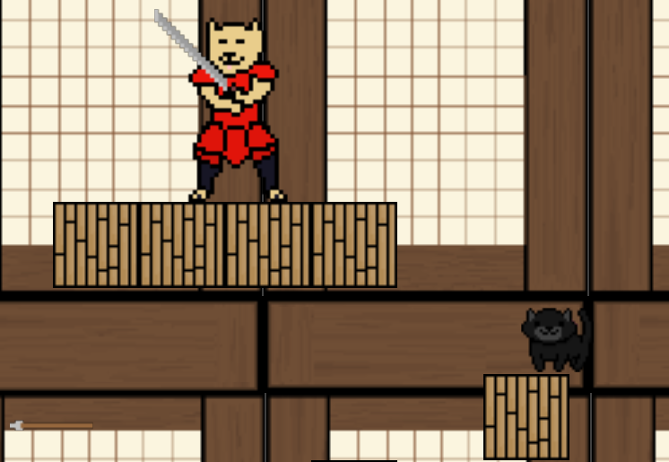

Ninja cat has you playing as a cat ninja while weaving through enemies like shiba-samurai or other obstacles.

Ninja cat was built using GameMaker Studio (https://steamcommunity.com/app/214850).  All art, code, and other foundations of the game was created by me. 
The game is not fully finished yet but I hope to finish it by the time I graduate. So far I have movement, players can use the arrow keys to move right and left and jump up.  I also implemented the iconic platform double jump feature and a 'climbing' skill. If the ninja cat is near a wall the player can spam the space bar and to jump/climb up the wall. Players can encounter friendly animals like the panda. The panda acts like a trampoline for players. Players must also look out for the scary samurai doge! Samurai doge's can wield a variety of weapons and can cause a game over if the players are caught by them or their weapons.  But don't worry they usually are pretty slow and you can bounce on top of their head. I also implemented coins and checkpoints.  There is also a fish shuriken skill that is still undergoing development, the idea is to have a fish shuriken that you can buy with coins in case you need to stun enemies. 

To see actual gameplay please take a look at the video below :D 
<video width="640" height="480" controls>
  <source src="https://raw.githubusercontent.com/iwalanicampbell/iwalanicampbell.github.io/main/img/ninjacat/NinjacatTutorialVideo.mp4" type="video/mp4">
</video>

