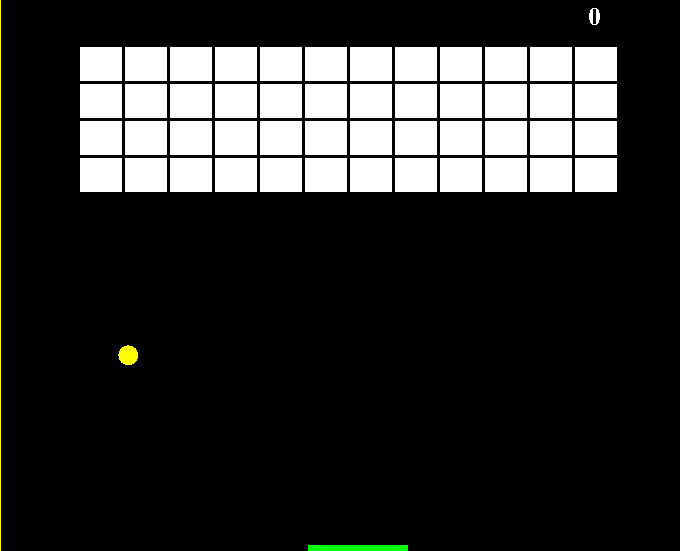

A simple brick breaker game that emulates the style of a retro game, built in Java.   Uses arrows keys for movement map regenerates after every stage, main goal is to get highest score.

*Sample Code* 
```

  public void actionPerformed(ActionEvent e) 
  {
    timer.start();
    if(play)
    {     
      if(new Rectangle(ballposX, ballposY, 20, 20).intersects(new Rectangle(playerX, 550, 30, 8)))
      {
        ballYdir = -ballYdir;
        ballXdir = -2;
      }
      else if(new Rectangle(ballposX, ballposY, 20, 20).intersects(new Rectangle(playerX + 70, 550, 30, 8)))
      {
        ballYdir = -ballYdir;
        ballXdir = ballXdir + 1;
      }
      else if(new Rectangle(ballposX, ballposY, 20, 20).intersects(new Rectangle(playerX + 30, 550, 40, 8)))
      {
        ballYdir = -ballYdir;
      }
      ...
```
