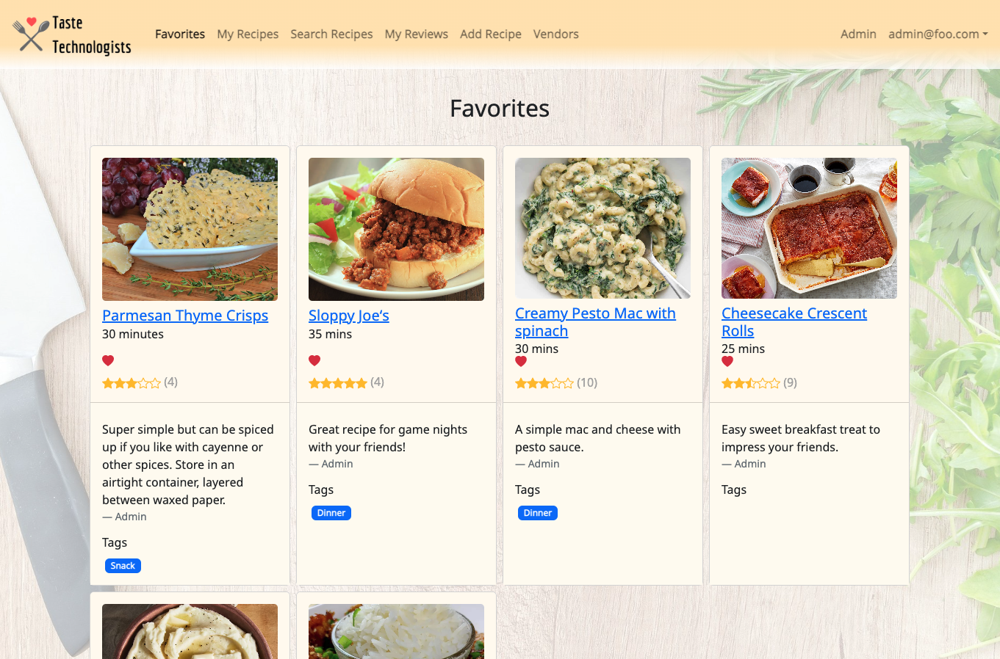
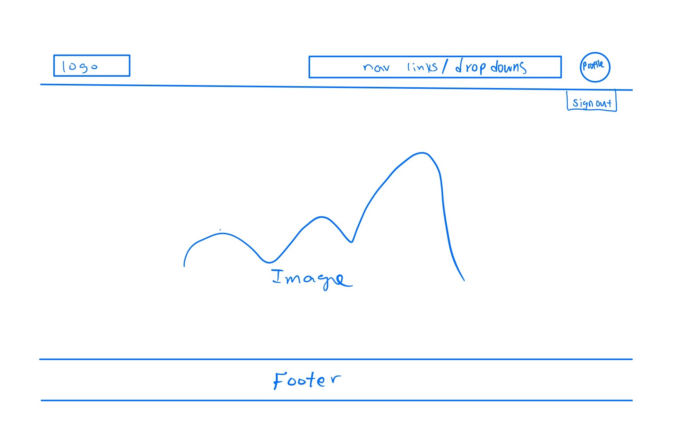

Taste Technologists was implemented using [Meteor](http://meteor.com), a JavaScript application platform. This project helped me learn how to design and implement a responsive web site using [MongoDB](http://mongodb.com) databases, [Bootstrap](http://getbootstrap.com/) CSS Framework for the user interface, and Javascript for both client and server-side programming. 

During this project there were 3 Milestones, the image above is an example of one of the fully completed pages.  In each milestone we tasked ourselves with different responsibilities for the app.  In milestone 1 we planned out and created the barebones website for our app and deployed it onto Open Ocean.  We also successfully completed the logisitcal tasks for milestone 1. The image on bottom is our sketch of what we wanted the page to look like.

During milestone 2 we implemented the bulk of our functionalities like adding, editing for recipes, vendors.  As well as create a way for users to have different user roles.  This would be crucial for us to create vendors and ingreidents.  We created an admin dashboard for admins to have a quick glimpse of the collections and so that they could add/edit/delete anything that may be inappropiate.

In milestone 3 we completed finishing touches and a beyond the basics functionality.  We wrapped up the recipes by giving user's the cost of the dish using the total cost of the ingredients as well as giving them the location's of the ingredients using the vendors near UH Manoa.  Our beyond the basic functionality was a review system that allowed all users to leave a rating and comment about a recipe.  If you are interested more information can be found on our page [Taste Technologists](https://taste-technologists.github.io/)

