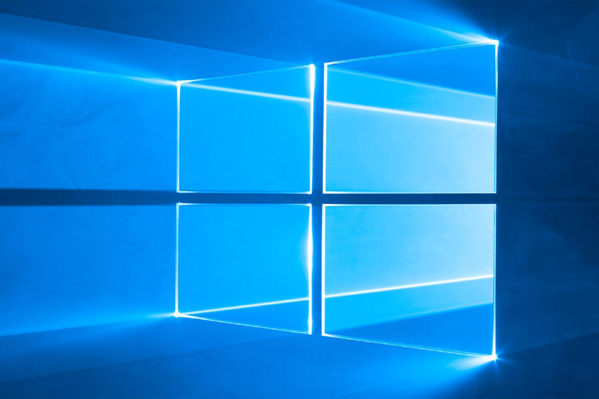

With an interest in Cybersecurity I have particpated in CyberPatriot, Hivestorm and CCDC.  I have worked with various OS during competitions but it seems that I always get stuck with a Windows machine.  So, in order to save my sanity and the energy in my fingers I have created a security template that does updates the Windows machine with better cybersecuirty practices.  I learned more about Windows OS and I learned about bash scripting.
 
Source: <a href="https://github.com/iwalanicampbell/iwalanicampbell.github.io/blob/main/CCDC.inf">iwalanicampbell/CCDC</a>
